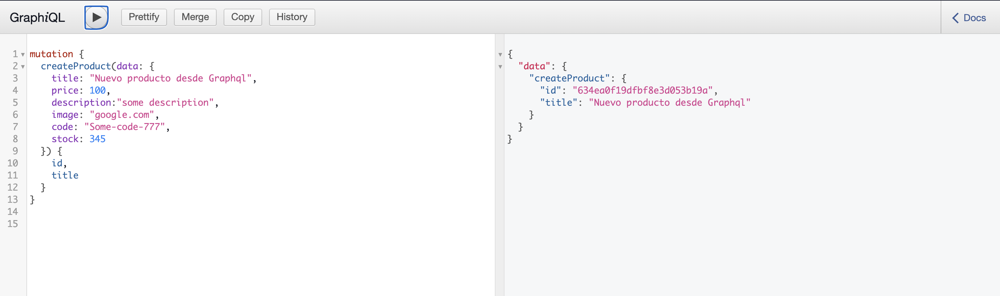

# Usando GRAHPQL
## _Ecommerce Backend App_

[](https://travis-ci.org/joemccann/dillinger)

En este desafío se modifica el proyecto para el uso de GraphQL. Se incluye la carpeta "graphql" en la que se encuentran a su vex las subcarpetas de inputs, mutations, queries, types y el archivo "Schema.js" en el que se construye el esquema general para el CRUD de la base de datos respectiva. 

## Inicializar la app

Para poder realizar los tests en graphiql hay que levantar primero el servidor con el siguiente comando:

```console
npm run server
```

Si el anterior comando no inicia la app se puede usar el siguiente:

```console
npx nodemon --inspect ./src/server.js -p 3031
```

## Features

### CRUD en GraphQL

Para visualizar la vista de GraphiQL se debe ingresar a la siguiente ruta: 

http://localhost:3031/graphql

#### Ejemplo de mutación en GraphQL

- Crear producto



- Eliminar producto por ID


#### Ejemplo de queies en GraphQl

