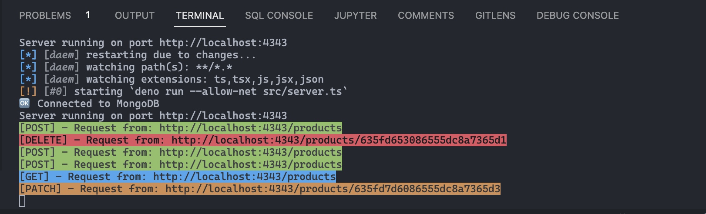

# Servidor en Deno
## _Ecommerce Backend App_

[](https://travis-ci.org/joemccann/dillinger)

En esta entrega se realiza un servidor y su CRUD respectivo en Deno. Se exportan los módulos necesarios para la configuración y conexión a la base de datos en MongoDB. Igualmente, se crean las carpetas de handlers, middlewares, routes y types. 

En el archivo "server.ts" se crea el servidor con el puerto respectivo. 

## Inicializar la app

Para levantar el servidor se debe ingresar en la consola o terminal el siguiente comando:

```console
denon start
```

## Features

### Rutas y métodos

Las pruebas de las rutas y métodos del CRUD se pueden realizar en Postman y en la terminal se visualiza el color respectivo, como se muestra en la siguiente imágen:

